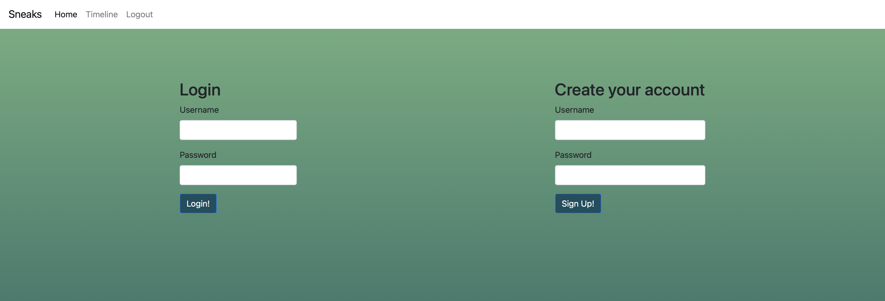

# SNEAKS

## Description

This application is a platform where users can share their passion and love for shoes. Our application's first step is for users to signup and/or login into their accounts so they can post shoes and see a feed of shoes. Each user will have their own collection and they can update their shoe collection everytime they post. When the user post/updates their collection, the post will be shared in a global feed where other users will be able to view the post. 

## Technology 

- HTML
- CSS
- Javascript
- Bootstrap: 4.6
- MySql: 8.0.31
- BCrypt: 5.1.0
- Connect-session-sequelize: 7.1.5
- Dotenv: 16.0.3
- Express: 4.18.2
- Express-handlebars: 7.0.4
- Express-session: 1.17.3
- Handlebars: 4.7.7
- Mysql2: 3.2.0
- Sequelize: 6.30.0
- Upload-JS: 2.11.2

## Usage

AS AN user I will signup then login in the website 

- I WANT TO go home 
  - SO THAT I can upload my new shoe 

- I WANT TO go to my collection 
  - SO THAT I can see my shoes 

- I WANT TO go to my feed 
  - SO THAT I can see other users’ posts 

- I WANT TO click logout 
  - SO THAT I can end my user session 

## License

MIT LICENSE

## Criteria for Project

- Use Node.js and Express.js to create a RESTful API.
- Use Handlebars.js as the templating engine.
- Use MySQL and the Sequelize ORM for the database.
- Have both GET and POST routes for retrieving and adding new data.
- Be deployed using Heroku (with data).
- Use at least one new library, package, or technology that we haven’t discussed.
- Have a polished UI.
- Be responsive.
- Be interactive (i.e., accept and respond to user input).
- Have a folder structure that meets the MVC paradigm.
- Include authentication (express-session and cookies).
- Protect API keys and sensitive information with environment variables.
- Have a clean repository that meets quality coding standards (file structure, naming conventions, follows best practices for class/id naming conventions, indentation, quality comments, etc.).
- Have a quality README (with unique name, description, technologies used, screenshot, and link to deployed application).

## Repository Link

[Github](https://github.com/Quailll/project-2)

## Website Link

[SNEAKS](https://fathomless-lake-56395.herokuapp.com/)

## Screen Shots

### Login/Signup 

When the user enters the website they will be directed to either login or signup. 
* New users can signup by creating a username and password. 
* If you already have singned up, all you need to do is login with your created username and password. 

### Homepage

When users start their session, they will be redirected to the home page. This is where the user's collection is located. You can also access the homepage through our navigation bar, just click "HOME".

### New post 

If the user wants to post a new item, on the homepage, they must click "POST NEW SHOE". The user will be redirected to a new page, where the user will need to fill out a form regarding the name, the brand, the style, and upload a picture of their shoes. 

### Edit post 

If the user wants to edit a post, on the homepage, they must click "EDIT". The user will be redirected to a new page, where the user will need to fill out a form regarding the name, the brand, the style, and upload a picture of their shoes. 

### Feed

If the user wants to checkout shoes from other users, on the navigation bar, they must click "TIMELINE". The user will be redirected to a new page, where the user will be able to see the most recent shoe posts from other users. 

### Logout 

If the user is done using the application, on the navigation bar, they must click "LOGOUT". The user will be redirected to the login page, where they have the option to signup or login to their session. 

